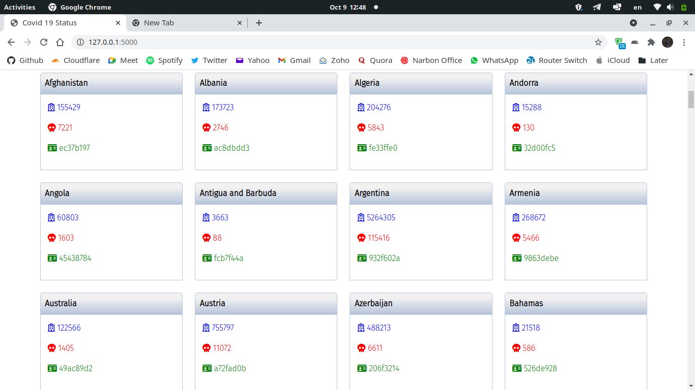

# Covid 19

In this project we see total count of people who got this virus and total death.

### How does it works

- Written in **Python**.
- Web app, **Flask**.
- package managing with **PipEnv**.
- Using **CovidAPI**.
- Domain with **CloudFlare**.
- Developed by **Amirhossein**.
- Hosted by **Heroku**.

### Where to see

Open [covid-blackiq.herokuapp.com/](https://covid-blackiq.herokuapp.com/).

### Contribute

For small changes, open an issue or do it by yourself.

### How to run

- First clone it and go to the directory. Run `pipenv shell`.

```shell
$ git clone https://github.com/BlackIQ/covid
$ cd covid
$ pipenv shell
$ pip install flask requests
```

- Export variables and run **Flask app**.

```shell
$ export FLASK_APP=wsgi.py
$ export FLASK_ENV=development
$ flask run
```

- After go to `127.0.0.1:5000` in your broswer.

[](#)

### Hacktoberfest

Now is **October 9** and here is **Hacktoberfest**. Contribute on this project to get label.

### The last word

Protect your self, Wear a mask. Get vaccinated if you have not already.

### License

This project is licensed under **GPL-3** license

### TODO

- [x] Front-End design
- [x] Deploy
